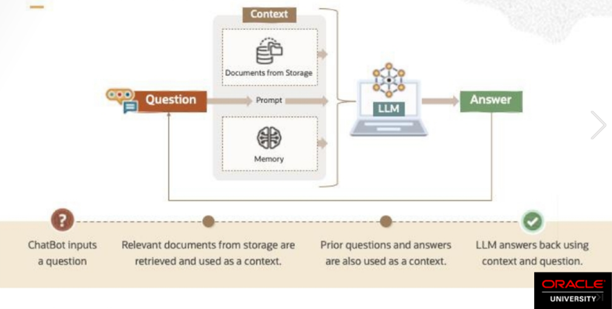

In this section, I built a Retrieval-Augmented Generation (RAG) pipeline in `create_RAG_chatbot.py` script using Oracle Database 23ai (AI Vector Search) and LangChain framework to enable a chatbot-like experience for answering questions about a provided PDF document following next architecture:


**Figure 1**: RAG ChatBot architecture.

Next variables must be first stated in the script before running:

```python
username = " "              # Oracle Database username  
password = " "              # Oracle Database password  
dsn = ''' '''               # Oracle Database DSN (host:port/service_name)  
COMPARTMENT_OCID = " "      # OCI Compartment OCID  
YOUR_MODEL_ID = " "         # OCI GenAI embedding model ID  
YOUR_SERVICE_ENDPOINT = " " # OCI GenAI service endpoint  
PATH_TO_PDF = " "           # Path to the PDF to process  
TABLE_NAME = " "            # Name of the table to store document embeddings  
COHERE_API_KEY = " "        # Cohere API key for the LLM  
TEMPERATURE = 0.7           # LLM temperature (randomness)  
user_question = " "         # Question to ask about the PDF  
"""
