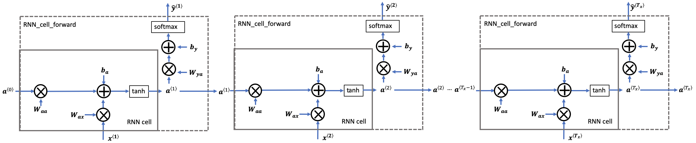

In this section I built and trained a character level language model from scratch to generate new dinosaurus names (`create_dinosaurus_model`). The network architecture is as follows:

**Figure 1**: Basic RNN. The input sequence  
\( x = (x^{\langle 1 \rangle}, x^{\langle 2 \rangle}, \ldots, x^{\langle T_x \rangle}) \)  
is carried over \( T_x \) time steps. The network outputs  
\( y = (y^{\langle 1 \rangle}, y^{\langle 2 \rangle}, \ldots, y^{\langle T_x \rangle}) \).

Some definitions:
* Superscript $[l]$ denotes an object associated with the $l^{th}$ layer. 
* Superscript $(i)$ denotes an object associated with the $i^{th}$ example. 
* Superscript $\langle t \rangle$ denotes an object at the $t^{th}$ time 
step. 
* Subscript $i$ denotes the $i^{th}$ entry of a vector.
    * For example: $a^{(2)[3]<4>}_5$ denotes the activation of the 2nd training example (2), 3rd layer [3], 4th time step <4>, and 5th entry in the vector.
* $n_x$: number of units (like a one-dimensional one-hot encoded vector) in a single time step of a single training example
* $T_{x}$: denotes the number of timesteps in the longest sequence.
* $m$: denotes the number of training examples per batch.
* $a^{\langle t \rangle}$: hidden state that is passed to the RNN from one time step to another.
* Hidden state: $a^{\langle t \rangle} = \tanh(W_{aa} a^{\langle t-1 \rangle} + W_{ax} x^{\langle t \rangle} + b_a)$.
* Prediction: $\hat{y}^{\langle t \rangle} = softmax(W_{ya} a^{\langle t \rangle} + b_y)$.

I also implemented two important techniques from scratch to build the model:

|  |  |
|:-----------------------------:|:----------------------------------:|
| **Figure 1**: Gradient clipping to To avoid exploding gradients | **Figure 2**: Sampling technique to generate characters |

All implementations from scratch are contained in `rnn_lstm_blocks.py`:
Implementing the forward passes for both the basic RNN and the LSTM:
- RNN blocks:
    - RNN Cell
    - RNN Forward Pass (forward propagation in batches)
    - RNN Forward Pass for Character Generation (forward propagation for a single training example)
    - RNN Backward for Character Generation
- LSTM blocks
    - LSTM Cell
    - LSTM Forward Pass
- Inference utilities
    - Clipping
    - Sampling
    - Softmax

Notice that I coded the basic LSTM blocks from scratch for another model I am working on.

<caption>
<b>Figure 2</b>: LSTM over multiple time steps. 
</caption>
