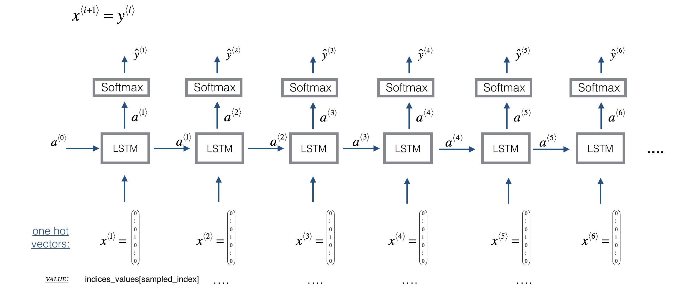

In this section I built and trained an LSTM using Keras to generate Jazz music (`create_jazz_model.ipynb`). The network architecture is as follows:

**Figure 1**: Basic LSTM model.

Some definitions:
* $X = (x^{\langle 1 \rangle}, x^{\langle 2 \rangle}, \cdots, x^{\langle T_x \rangle})$ is a window of size $T_x$ scanned over the musical corpus, where each $x^{\langle t \rangle}$ is an index corresponding to a value.
* The first input is not $x^{\langle 1 \rangle} = \vec{0}$, since most of these snippets of audio (which have the same length $T_x = 30$ to make vectorization easier) start somewhere in the middle of a long piece of music. 

Once the model is trained model, I used it to synthesize new music using the sampling technique:

**Figure 2**: Generating new values in an LSTM

This project uses these scripts to manage audio data (the original authors of the reused code are listed in the header comments of the corresponding scripts):
- `preprocess.py`: parse, cleanup and process data.
- `data_utils.py`: generates jazz music from a trained LSTM model and converts it to audio.
- `music_utils.py`: prepares and encodes music grammar data for model input and generation.
- `qa.py`: provide pruning and cleanup functions.
- `grammar.py`: extract, manipulate, process musical grammar.
