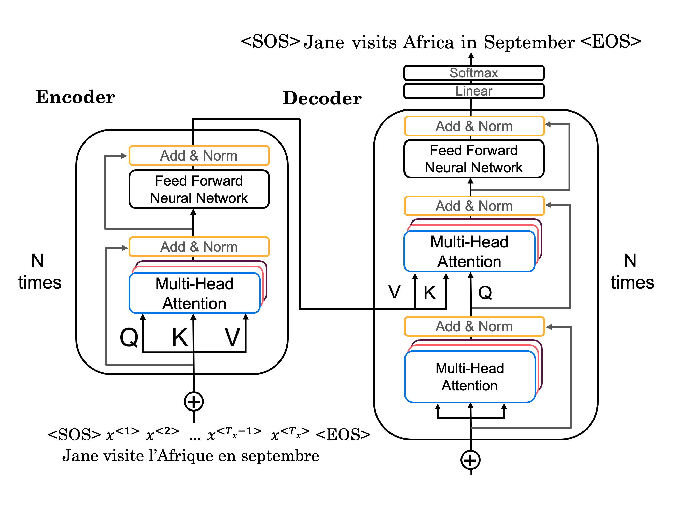
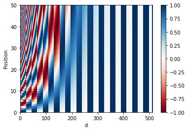
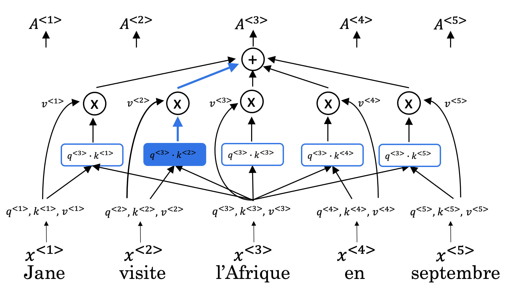

In this section I built a Transformer architecture using TensorFlow ready for training it. The network architecture is as follows:

**Figure 1**: Transformer architecture.

The data flow through the Transformer Architecture is as follows:

- Input passes through an Encoder, which is just repeated encoder layers that you implemented:
    - Embedding and positional encoding the input.
    - Multi-head attention on the input.
    - Feed forward neural network to help detect features.
- Predicted output passes through a Decoder, consisting of repeated decoder layers:
    - Embedding and positional encoding of the output
    - Multi-head attention on the generated output.
    - Multi-head attention with the Q from the first multi-head attention layer and the K and V from the encoder,
    - A feed forward neural network to help detect features.
- After the Nth decoder layer, one dense layer and a softmax are applied to generate prediction for the next output in the sequence.

These workflow was implemented using TensorFlow in `transformer_blocks.py` which is divided in next sections:
- **Positional encoding functions**: create positional encodings to capture sequential relationships in data using these sine and cosine formulas:
$$
PE_{(pos,2i)} = \sin\left(\frac{pos}{10000^{2i/d}}\right)
$$

$$
PE_{(pos,2i+1)} = \cos\left(\frac{pos}{10000^{2i/d}}\right)
$$

    where $d$ is the dimension of the word embedding and positional encoding, $pos$ is the position of the word, and $k$ refers to each of the different dimensions in the positional encodings, with $i$ equal to $k$ $//$ $2$. Every pair of dimensions (2i, 2i+1) corresponds to one frequency, which is gradually decreases for higher i.

>| position | dim0 (sin)        | dim1 (cos)        | dim2 (sin)        | dim3 (cos)        | ... | dim d-2 (sin)         | dim d-1 (cos)         |
>|----------|-------------------|-------------------|-------------------|-------------------|-----|-----------------------|-----------------------|
>| **0**    | sin(θ(0,0,d))     | cos(θ(0,0,d))     | sin(θ(0,1,d))     | cos(θ(0,1,d))     | ... | sin(θ(0,d/2,d))       | cos(θ(0,d/2,d))       |
>| **1**    | sin(θ(1,0,d))     | cos(θ(1,0,d))     | sin(θ(1,1,d))     | cos(θ(1,1,d))     | ... | sin(θ(1,d/2,d))       | cos(θ(1,d/2,d))       |
>| **2**    | sin(θ(2,0,d))     | cos(θ(2,0,d))     | sin(θ(2,1,d))     | cos(θ(2,1,d))     | ... | sin(θ(2,d/2,d))       | cos(θ(2,d/2,d))       |
>| **…**    | …                 | …                 | …                 | …                 | …   | …                     | …                     |
>| **pos**  | sin(θ(pos,0,d))   | cos(θ(pos,0,d))   | sin(θ(pos,1,d))   | cos(θ(pos,1,d))   | ... | sin(θ(pos,d/2,d))     | cos(θ(pos,d/2,d))     |

>
>**Figure 2**: Each row represents a positional encoding; none of the rows are identical.

- **Masking functions**: padding mask (sequences longer than the maximum length of five will be truncated, and zeros will be added to the truncated sequence to achieve uniform length) and look-ahead mask (helps the model to correctly predict the next output without looking ahead).
- **Self-attention function** (from the paper ["Attention is All You Need"](https://arxiv.org/abs/1706.03762)): implements scaled dot product attention which takes in a query (Q), key (K), value (V), and a mask (M) as input matrices to return rich, attention-based vector representations of the words in the sequence. This type of self-attention can be mathematically expressed as:
$$
\mathrm{Attention}(Q, K, V) =
\mathrm{softmax}\!\left(\frac{Q K^{T}}{\sqrt{d_k}} + M \right) V
$$
    where ${d_k}$ is the dimension of the keys, which is used to scale everything down so the softmax doesn't explode.

>
>**Figure 3**: Self-Attention calculation visualization.

- **Encoder classes**: by pairing multi-head attention and a feed forward neural network.
- **Decoder classes**: again, by pairing multi-head attention with a feed forward neural network.
- **Transformer class**: wrapping up previous blocks to describe the data flow.
